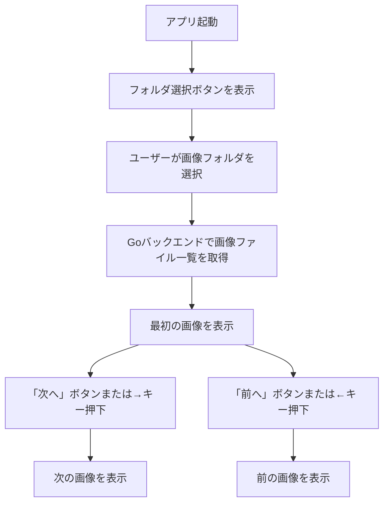

# UI仕様書：画像閲覧アプリ

## 1. 画面構成（初期表示）

アプリ起動直後に表示される画面要素は以下のとおりです：

* フォルダ選択ボタン（ユーザーが画像ディレクトリを指定）
* 画像表示エリア（1枚のみ表示）
* 「前へ」ボタン（1枚前の画像に移動）
* 「次へ」ボタン（1枚後の画像に移動）
* キーボード操作対応（←：前へ、→：次へ）

## 2. 表示対象ファイル仕様

* 対象ファイル拡張子：`.jpg`, `.jpeg`, `.png`, `.gif`, `.webp`, `.mp4`, `.pdf`
* 読み込み対象は指定ディレクトリ直下のみ（サブディレクトリはスキャン対象外）
* PDF は表示可能（5MB より大きなファイルは `file://` 経由でチャンク読み込みして Blob として表示）

## 3. 操作フロー図（Mermaid記法）

```mermaid
flowchart TD
    A[アプリ起動] --> B[フォルダ選択ボタンを表示]
    B --> C[ユーザーが画像フォルダを選択]
    C --> D[Goバックエンドで画像ファイル一覧を取得]
    D --> E[最初の画像を表示]

    E --> F[「次へ」ボタンまたは→キー押下]
    E --> G[「前へ」ボタンまたは←キー押下]

    F --> H[次の画像を表示]
    G --> I[前の画像を表示]
```

## 4. フォルダ選択処理

* ユーザーが画像表示対象のフォルダを選択するために、Wailsの`dialog.SelectDirectory()`を使用
* 選択後、そのディレクトリ内の画像ファイルパスをGoで取得し、Reactに渡して表示制御を行う

