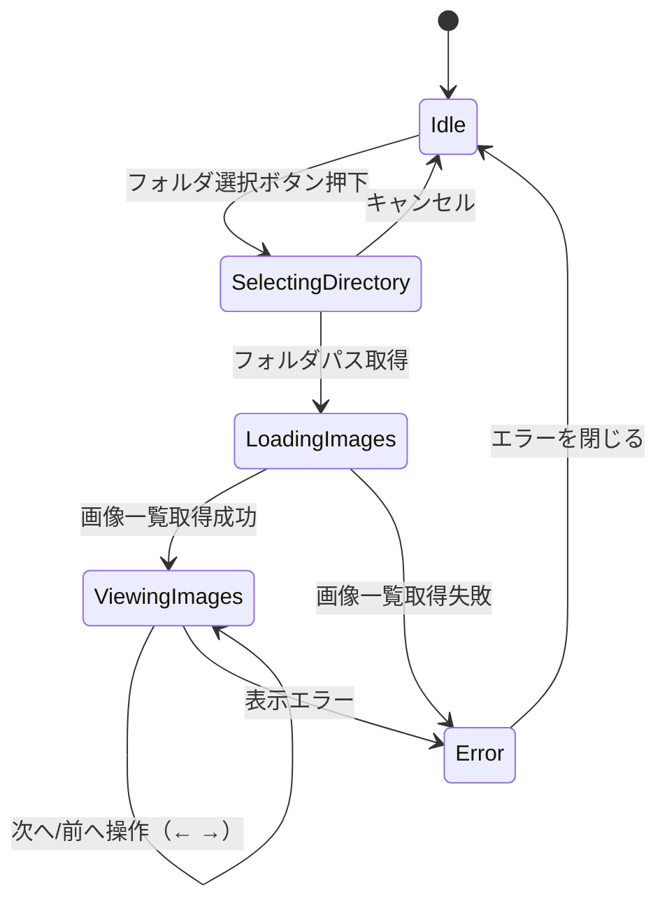

# 画像閲覧アプリ：UI設計・状態管理定義

このドキュメントは、画像閲覧アプリの UI ワイヤーフレーム定義、状態遷移、および状態管理仕様について記述したものである。

---

## 1. UIワイヤーフレーム（テキスト）

```
┌──────────────────────────────┐
│     画像閲覧アプリ（Mac）       │
├──────────────────────────────┤
│ [ フォルダ選択 ]                 │ ← フォルダダイアログを開くボタン
├──────────────────────────────┤
│                                  │
│         [画像表示エリア]         │ ← 選択中の画像を中央表示
│                                  │
├──────────────────────────────┤
│ [ ← 前へ ]       [ 次へ → ]       │ ← 前後移動ボタン（キーボード対応）     
└──────────────────────────────┘
```

---

## 2. 状態定義（State）

| State名              | 型           | 説明                                       |
|----------------------|--------------|--------------------------------------------|
| `directoryPath`      | `string`     | 選択された画像フォルダのパス               |
| `imageFiles`         | `string[]`   | 対象フォルダ内の画像ファイル一覧           |
| `currentImageIndex`  | `number`     | 現在表示中の画像インデックス（0始まり）   |
| `isLoading`          | `boolean`    | ローディング中フラグ                        |
| `error`              | `string?`    | エラーメッセージ（必要に応じて表示）       |

---

## 3. アクション定義（Action）

| アクション名            | トリガーUI                  | 処理内容                                                           |
|-------------------------|-----------------------------|--------------------------------------------------------------------|
| `handleSelectDirectory()` | フォルダ選択ボタン           | `SelectDirectory` → `GetImageFiles` を順に実行                    |
| `handlePrevImage()`     | 「前へ」ボタン / ←キー        | `currentImageIndex--`（最小0で制限）                              |
| `handleNextImage()`     | 「次へ」ボタン / →キー        | `currentImageIndex++`（最大length-1で制限）                       |
| `handleKeyPress(event)` | キーボードイベント           | 左右キー押下で前後画像へ移動                                     |
| `showError(message)`    | 各種エラーハンドリング箇所     | エラーメッセージを画面に表示                                      |

---

## 4. 状態遷移図（Mermaid）



---

## 5. 状態管理（useReducer）

### State 型

```ts
type AppState = {
  status: "idle" | "selecting" | "loading" | "viewing" | "error";
  directoryPath: string;
  imageFiles: string[];
  currentImageIndex: number;
  errorMessage?: string;
};
```

### Action 型

```ts
type Action =
  | { type: "SELECT_DIRECTORY" }
  | { type: "CANCEL_SELECTION" }
  | { type: "DIRECTORY_SELECTED"; payload: string }
  | { type: "IMAGES_LOADED"; payload: string[] }
  | { type: "IMAGE_LOAD_FAILED"; payload: string }
  | { type: "NEXT_IMAGE" }
  | { type: "PREV_IMAGE" }
  | { type: "CLEAR_ERROR" };
```

### Reducer 実装例

```ts
function reducer(state: AppState, action: Action): AppState {
  switch (action.type) {
    case "SELECT_DIRECTORY":
      return { ...state, status: "selecting" };
    case "CANCEL_SELECTION":
      return { ...state, status: "idle" };
    case "DIRECTORY_SELECTED":
      return {
        ...state,
        status: "loading",
        directoryPath: action.payload,
        imageFiles: [],
        currentImageIndex: 0,
      };
    case "IMAGES_LOADED":
      return {
        ...state,
        status: "viewing",
        imageFiles: action.payload,
        currentImageIndex: 0,
      };
    case "IMAGE_LOAD_FAILED":
      return {
        ...state,
        status: "error",
        errorMessage: action.payload,
      };
    case "NEXT_IMAGE":
      return {
        ...state,
        currentImageIndex: Math.min(state.currentImageIndex + 1, state.imageFiles.length - 1),
      };
    case "PREV_IMAGE":
      return {
        ...state,
        currentImageIndex: Math.max(state.currentImageIndex - 1, 0),
      };
    case "CLEAR_ERROR":
      return { ...state, status: "idle", errorMessage: undefined };
    default:
      return state;
  }
}
```
